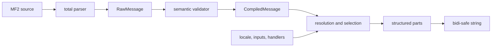

# なぜ MessageFormat 2 が必要か

文字列補間は「値を文字列にする」問題しか解きません。localization が必要とするのは、値の型、locale、文法、語順、方向、rich text、失敗時の振る舞いを、翻訳可能な message data model として扱うことです。

英語の `1 item` / `2 items` を三項演算子で作ると、ロシア語やアラビア語の plural category、翻訳時の語順変更、数値表記を application code に埋め込んでしまいます。MF2 は次を分離します。

- message author は pattern と variant を記述する。
- function handler は値を locale-aware に format/select できる resolved value にする。
- matcher は selector と variant key を比較する。
- formatter は選ばれた pattern を structured parts または string にする。

```mf2
.input {$count :number}
.match $count
0    {{No items}}
one  {{One item}}
*    {{{$count} items}}
```

ここで `0` は exact key、`one` は locale rule key、`*` は catch-all です。`one` の意味を message 自身へハードコードしない点が重要です。

## MF1 との関係

MF2 は ICU MessageFormat の後継ですが、MF1 syntax との backward compatibility は non-goal です。expression、declaration、function registry、markup、interchange data model を独立した概念として設計し直しています。

## コンパイラとして見る

MF2 processor は一段の template substitution ではありません。



この分割を [`MF2.Compiler`](../src/MF2/Compiler.idr)、[`MF2.Validate`](../src/MF2/Validate.idr)、[`MF2.Runtime`](../src/MF2/Runtime.idr) でそのままコードにしています。

## 仕様

- [Introduction](https://www.unicode.org/reports/tr35/tr35-78/tr35-messageFormat.html#introduction)
- [Syntax design goals](https://www.unicode.org/reports/tr35/tr35-78/tr35-messageFormat.html#design-goals)
- [Why MF2?](https://messageformat.unicode.org/docs/why/)
