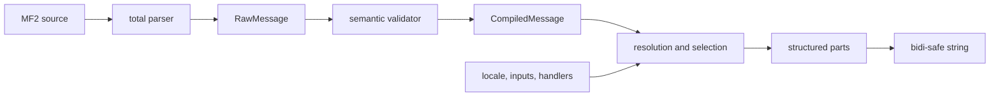

# Why MessageFormat 2 exists

String interpolation solves only the problem of turning a value into text. Localization also needs to represent value types, locales, grammar, word order, text direction, rich text, and failure behavior in a translatable message data model.

If English `1 item` / `2 items` is implemented with a conditional expression, plural categories for languages such as Russian and Arabic, translatable word order, and localized number formatting leak into application code. MF2 separates these responsibilities:

- The message author writes patterns and variants.
- Function handlers turn values into locale-aware resolved values that support formatting and selection.
- A matcher compares selectors with variant keys.
- A formatter turns the selected pattern into structured parts or a string.

```mf2
.input {$count :number}
.match $count
0    {{No items}}
one  {{One item}}
*    {{{$count} items}}
```

Here, `0` is an exact key, `one` is a locale-rule key, and `*` is the catch-all. Crucially, the message does not hard-code what `one` means.

## Relationship to MF1

MF2 is the successor to ICU MessageFormat, but backward compatibility with MF1 syntax is a non-goal. Expressions, declarations, function registries, markup, and the interchange data model have been redesigned as distinct concepts.

## Think of it as a compiler

An MF2 processor is not a single template-substitution step.



This separation appears directly in [`MF2.Compiler`](../src/MF2/Compiler.idr), [`MF2.Validate`](../src/MF2/Validate.idr), and [`MF2.Runtime`](../src/MF2/Runtime.idr).

## Specifications

- [Introduction](https://www.unicode.org/reports/tr35/tr35-78/tr35-messageFormat.html#introduction)
- [Syntax design goals](https://www.unicode.org/reports/tr35/tr35-78/tr35-messageFormat.html#design-goals)
- [Why MF2?](https://messageformat.unicode.org/docs/why/)
