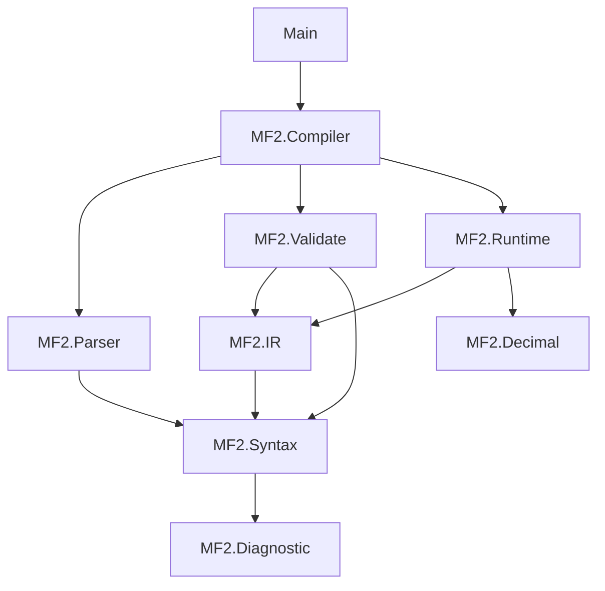

# Architecture

## dependency direction

## trust boundaries

- `String -> RawMessage`: grammar trust boundary。syntax error だけを扱う。
- `RawMessage -> CompiledMessage`: semantic trust boundary。data-model error と proof construction。
- `CompiledMessage + Context -> FormatResult`: runtime boundary。外部 input、locale、handler failure。
- `OutputPart -> UI`: presentation/security boundary。markup mapping と bidi。

## design rules

- parser は runtime function registry を知らない。
- validator は locale/input value を知らない。
- runtime は raw arity を再検査しない。
- default handlers と custom handlers は同じ `ResolvedValue` contract を返す。
- string formatting は structured output の上にだけ構築する。
- compiler core は CLDR data bundle に依存しない。

## public API

通常の caller は [`compile`](../src/MF2/Compiler.idr) と [`format`](../src/MF2/Compiler.idr) だけを使います。editor/tooling は [`parse`](../src/MF2/Parser.idr) と [`validate`](../src/MF2/Validate.idr) を分けて呼び、syntax/data-model diagnostics を別表示できます。

