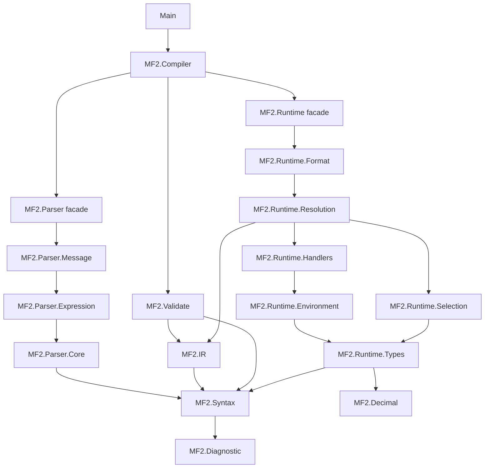

# Architecture

## Dependency direction

## Trust boundaries

- `String -> RawMessage`: grammar trust boundary; handles only syntax errors.
- `RawMessage -> CompiledMessage`: semantic trust boundary; handles data-model errors and proof construction.
- `CompiledMessage + Context -> FormatResult`: runtime boundary; handles external inputs, locales, and handler failures.
- `OutputPart -> UI`: presentation and security boundary; handles markup mapping and bidi.

## Design rules

- The parser knows nothing about the runtime function registry.
- The validator knows nothing about locale or input values.
- The runtime does not recheck raw arity.
- Default and custom handlers return the same `ResolvedValue` contract.
- String formatting is built only on top of structured output.
- The compiler core does not depend on a CLDR data bundle.

## Public API

Typical callers need only [`compile`](../src/MF2/Compiler.idr) and [`format`](../src/MF2/Compiler.idr). Editors and other tooling may call [`parse`](../src/MF2/Parser.idr) and [`validate`](../src/MF2/Validate.idr) separately to present syntax and data-model diagnostics independently.
